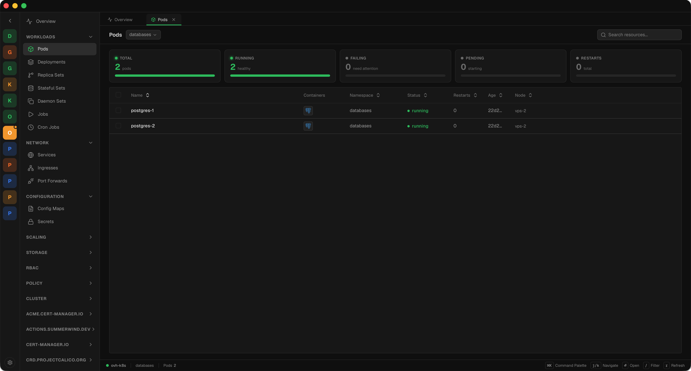

<div align="center">


# kdashboard

**A desktop IDE for Kubernetes.**

Multi-context, multi-namespace resource management with topology, cost
visibility, security overview, and diagnostics — built on Tauri 2 and
Svelte 5, available for macOS, Linux, and Windows.

[](https://github.com/folio-pro/kdashboard/releases/latest)
[](LICENSE.md)
[](https://v2.tauri.app)
[](https://svelte.dev)
[](https://www.rust-lang.org)

[Download](https://github.com/folio-pro/kdashboard/releases/latest) · [Features](#features) · [Install](#installation) · [Quick start](#quick-start) · [Development](#development) · [Architecture](#architecture) · [Contributing](CONTRIBUTING.md)

</div>

---

## Why kdashboard

Running clusters through `kubectl` is fast but noisy, and most GUI
alternatives struggle on clusters with thousands of resources. kdashboard
is a desktop app with the ergonomics of an IDE — built for operators who
switch between contexts and namespaces all day and want a single place to
inspect, debug, and act on workloads.

## Features

- **Multi-context, multi-namespace** — switch contexts without reloading,
  pin favourites, and scope views per namespace.
- **Resource topology** — interactive graph of Deployments, Services,
  Ingresses, Pods, and their relationships.
- **Pod lifecycle tools** — streaming logs with regex filtering, exec via
  embedded xterm.js, and port-forwarding with one click.
- **Cost visibility** — per-namespace and per-workload cost estimates.
- **Security overview** — RBAC, NetworkPolicy, PodSecurity, and image
  posture at a glance.
- **Diagnostics** — surface events, warnings, and common failure modes for
  each resource.
- **CRD-aware** — custom resources are first-class citizens.
- **Command palette** — keyboard-first navigation for every action.
- **YAML editor** — CodeMirror 6 with schema linting and diff view.
- **Built for large clusters** — virtualised tables, incremental watchers,
  and a Rust backend that streams rather than polls.

## Screenshots

<p align="center">
  
</p>

## Installation

### Pre-built binaries

Grab the [latest release](https://github.com/folio-pro/kdashboard/releases/latest)
for your platform (see all past builds on the
[Releases page](https://github.com/folio-pro/kdashboard/releases)):

- **macOS** — `.dmg` (Apple Silicon and Intel)
- **Linux** — `.AppImage`, `.deb`, `.rpm`
- **Windows** — `.msi`, `.exe`

> **macOS note — unsigned builds.** Releases are not yet signed with an
> Apple Developer ID, so Gatekeeper will block the app on first launch
> ("kdashboard is damaged and can't be opened" or "cannot be opened
> because the developer cannot be verified"). You have two options:
>
> 1. **Remove the quarantine flag** after installing the `.dmg`:
>
>    ```bash
>    xattr -cr /Applications/kdashboard.app
>    ```
>
>    Then open the app normally. You only need to run this once.
>
> 2. **Build from source** (see [Development](#development)) — locally
>    produced binaries are not flagged by Gatekeeper.
>
> Proper Apple Developer signing + notarization will replace this workaround
> once the certificates are provisioned.

### Build from source

See [Development](#development) below.

## Quick start

1. Launch kdashboard.
2. It auto-discovers contexts from `~/.kube/config` (and `KUBECONFIG` if set).
3. Pick a context from the sidebar, choose a namespace, and browse resources.
4. Press `⌘K` / `Ctrl+K` to open the command palette.

kdashboard does not require any in-cluster agent. It talks to the Kubernetes
API using your existing kubeconfig and credentials.

## Development

### Prerequisites

- Rust stable — install via [rustup](https://rustup.rs)
- Node.js 20+ and [Bun](https://bun.sh)
- Platform build dependencies per the
  [Tauri prerequisites](https://v2.tauri.app/start/prerequisites/)

### Setup

```bash
git clone https://github.com/folio-pro/kdashboard.git
cd kdashboard
bun install
cargo fetch --manifest-path src-tauri/Cargo.toml
```

### Run

```bash
bun run tauri dev
```

### Test

```bash
bun test                                              # Frontend unit tests
cargo test --manifest-path src-tauri/Cargo.toml       # Rust backend tests
bun run test:e2e                                      # Playwright E2E
```

### Build a release

```bash
bun run tauri build
```

Artifacts land in `src-tauri/target/release/bundle/`.

## Architecture

```
┌────────────────────────────────────────────────────────────┐
│                 Svelte 5 frontend (src/)                   │
│  Runes-based stores · virtualised tables · CodeMirror 6    │
└───────────────────────────┬────────────────────────────────┘
                            │ Tauri IPC (typed commands)
┌───────────────────────────┴────────────────────────────────┐
│                 Rust backend (src-tauri/)                  │
│  kube-rs client · tokio watchers · streaming logs/exec     │
└───────────────────────────┬────────────────────────────────┘
                            │
                    Kubernetes API server
```

- **Frontend** — Svelte 5 with runes, Tailwind 4, bits-ui primitives,
  TanStack Virtual for large lists, xterm.js for terminals, CodeMirror 6
  for YAML editing.
- **Backend** — Rust with `kube-rs`, `tokio`, and `k8s-openapi`. Long-lived
  watchers stream resource deltas to the UI; logs and exec are piped over
  Tauri channels.
- **IPC** — typed Tauri commands; no HTTP server runs on the host.

See [`src/lib/`](src/lib) and [`src-tauri/src/`](src-tauri/src) for module
layout.

## Roadmap

- Helm release browser and values editor
- Prometheus metrics overlay on topology
- Cluster health scorecard
- Plugin API for custom views

Track progress and discuss priorities in
[GitHub Discussions](https://github.com/folio-pro/kdashboard/discussions).

## Contributing

Contributions are welcome. Read [CONTRIBUTING.md](CONTRIBUTING.md) for the
development process, commit conventions, and CLA. For security issues, see
[SECURITY.md](SECURITY.md) — do not open public issues for vulnerabilities.

## License

Source-available under the Functional Source License, Version 1.1, with an
Apache 2.0 future grant (**FSL-1.1-Apache-2.0**). Every release automatically
converts to Apache 2.0 on the second anniversary of its publication.

See [LICENSE.md](LICENSE.md) for the full terms, [NOTICE](NOTICE) for
attribution, and [TRADEMARK.md](TRADEMARK.md) for use of the kdashboard
name and logo.

---

<div align="center">
<sub>Built with <a href="https://v2.tauri.app">Tauri</a>, <a href="https://svelte.dev">Svelte</a>, and <a href="https://kube.rs">kube-rs</a>.</sub>
</div>
