<div align="center">


# kdashboard

### The desktop IDE for Kubernetes.

One window for every cluster you operate: live resource tables, a diagnosis
engine that tells you *why* something is broken, streaming logs, in-pod shells,
a YAML editor with revision diffs, topology, RBAC, cost and security — built on
Electron and Svelte 5 for macOS, Linux and Windows.

<br />

[](https://github.com/folio-pro/kdashboard/releases/latest)
[](https://github.com/folio-pro/kdashboard/releases)
[](https://github.com/folio-pro/kdashboard/actions/workflows/tests.yml)
[](https://github.com/folio-pro/kdashboard/actions/workflows/build.yml)
[](LICENSE.md)
[](#installation)

[](https://www.electronjs.org)
[](https://svelte.dev)
[](https://www.typescriptlang.org)
[](https://bun.sh)

<br />

**[Download](https://github.com/folio-pro/kdashboard/releases/latest)** ·
[Highlights](#highlights) ·
[Tour](#tour) ·
[Install](#installation) ·
[Quick start](#quick-start) ·
[Shortcuts](#keyboard-shortcuts) ·
[Extensions](#extensions) ·
[Architecture](#architecture) ·
[Development](#development) ·
[Contributing](#contributing)

<br />

<picture>
  <source media="(prefers-color-scheme: dark)" srcset="docs/screenshots/pods-dark.png" />
  <source media="(prefers-color-scheme: light)" srcset="docs/screenshots/pods-light.png" />
  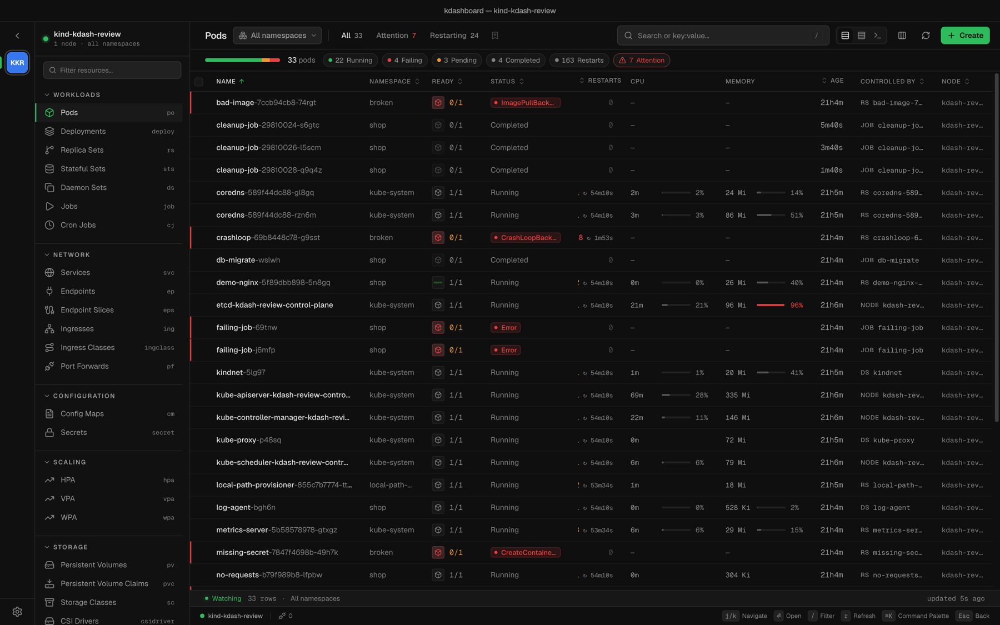
</picture>

<sub>Pods across every namespace of a Kind cluster, with live usage from <code>metrics.k8s.io</code>. Dark and light themes ship in the box.</sub>

</div>

<br />

## Why kdashboard

`kubectl` is fast but noisy. Most GUIs are either a thin wrapper around it or
fall over on clusters with thousands of objects. kdashboard is built like an
IDE, for people who switch between contexts and namespaces all day:

- **It tells you what is wrong, not just that something is.** The Problems
  view correlates workload status, events and pod conditions into a diagnosis
  with a next step, and links straight to the logs that explain it.
- **It never leaves the cluster half-read.** Lists stream through shared
  watchers, tables are virtualised, and payloads are projected down to the
  columns on screen. Ten thousand pods scroll like ten.
- **It works with what you already have.** Your kubeconfig, your RBAC, your
  metrics-server, optionally your Prometheus and a local `trivy`. No agent in
  the cluster, nothing phones home — even the AI agent is your own Claude Code
  or Codex CLI, talking to the cluster through a loopback-only endpoint.

## Highlights

<table>
  <tr>
    <td width="50%" valign="top">
      <b>Multi-context, multi-namespace</b><br />
      Switch contexts without reloading, pin favourites, scope every view per namespace or go cluster-wide. The namespace picker only lists what your RBAC lets you read.
    </td>
    <td width="50%" valign="top">
      <b>Problems &amp; Overview</b><br />
      A cluster health page and a diagnosis engine: crash loops, image pulls, unschedulable pods, failed jobs, pending volumes, services with no endpoints — each with a cause and a suggested fix.
    </td>
  </tr>
  <tr>
    <td valign="top">
      <b>Debug in place</b><br />
      Streaming logs with level filters, regex search and time windows. An embedded xterm.js shell into any container, node shells via a privileged debug pod, ephemeral debug containers and one-click port-forwards you can save.
    </td>
    <td valign="top">
      <b>Change safely</b><br />
      CodeMirror 6 YAML editor with schema linting, a diff before apply, revision history with side-by-side pod-template diffs, quick-edit for images and env, and confirmations on every destructive action.
    </td>
  </tr>
  <tr>
    <td valign="top">
      <b>Topology &amp; NetworkPolicy</b><br />
      An interactive graph of Deployments, Services, Ingresses, Pods, ConfigMaps and Secrets with a NetworkPolicy overlay that shows what can actually talk to what.
    </td>
    <td valign="top">
      <b>Security &amp; RBAC explorer</b><br />
      Image vulnerability posture through a local <code>trivy</code> or <code>grype</code>, PodSecurity compliance, and a permissions explorer that answers "can this ServiceAccount get pods in shop?" across every Role, ClusterRole and group.
    </td>
  </tr>
  <tr>
    <td valign="top">
      <b>Cost &amp; Rightsizing</b><br />
      Per-namespace and per-pod cost estimates from a scheduled cloud pricing dataset, plus request recommendations against real usage with an <i>Apply</i> button that writes the patch.
    </td>
    <td valign="top">
      <b>Helm, CRDs, Events</b><br />
      Every Helm release read from its <code>sh.helm.release.v1</code> Secret (values, manifest, notes, history) with no <code>helm</code> binary. CRDs are first-class with printer columns. A kubectl-style live Events feed.
    </td>
  </tr>
  <tr>
    <td valign="top">
      <b>AI agent, bring your own CLI</b><br />
      Run Claude Code or Codex in a bottom panel (<kbd>⌘J</kbd>) wired to the cluster through an MCP endpoint kdashboard serves on localhost: read tools (resources, logs with grep, events, metrics, Prometheus, the Problems scan, rightsizing) plus four mutations, each behind an Approve / Deny dialog. Quick Actions, presets and "investigate with agent" buttons start it already pointed at the right thing.
    </td>
    <td valign="top">
      <b>MCP server for your AI tools</b><br />
      Optionally expose the same tool surface on a fixed localhost port with a bearer token, so Claude Desktop, Claude Code, Cursor or Codex use kdashboard as their Kubernetes MCP server — with the same in-app approval on every mutation. Copy-paste client configs in Settings.
    </td>
  </tr>
  <tr>
    <td valign="top">
      <b>Built for large clusters</b><br />
      Virtualised tables, lean list projections with lazy detail hydration, shared incremental watchers batched at 50 ms, and a frame scheduler that keeps draining when the window is in the background.
    </td>
    <td valign="top">
      <b>Keyboard first</b><br />
      A command palette that searches resources across the cluster and exposes every action, Vim-style navigation in tables, single-key shortcuts for logs, shell, edit and scale, session restore and eleven themes.
    </td>
  </tr>
</table>

## Tour

### Know what is broken before anyone pages you

The Overview aggregates nodes, pods, problems and last-hour warnings for a
namespace or the whole cluster. Problems groups everything that needs
attention, explains it, and links to the pod logs or the object that caused it.

<p align="center">
  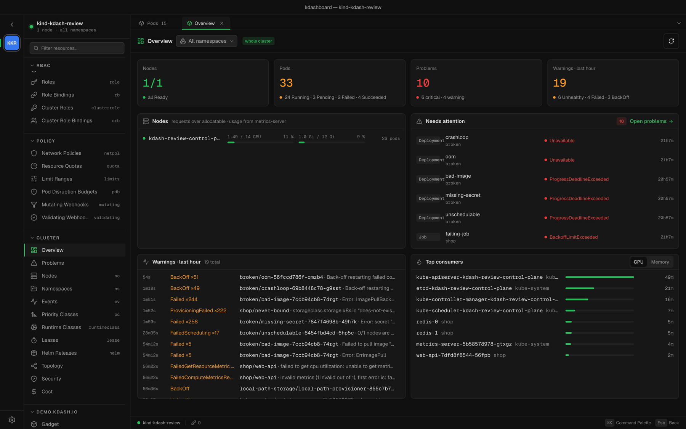
</p>

<p align="center">
  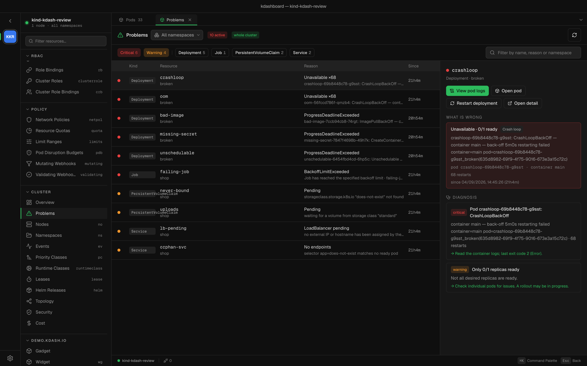
</p>

### Debug without leaving the window

A pod detail shows containers, requests against limits, live usage, conditions,
network, related objects and port-forwarding in one scroll. Logs stream with
level filters and regex search; the shell is a real terminal.

<p align="center">
  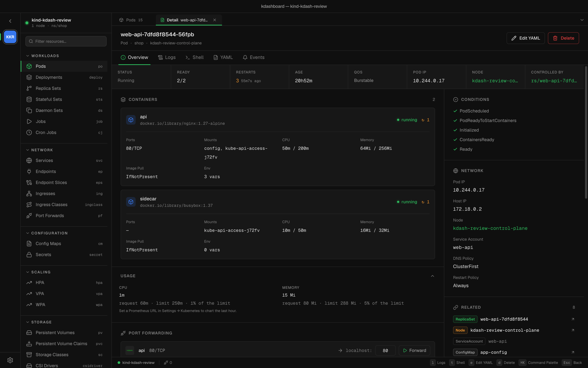
</p>

<table>
  <tr>
    <td width="50%">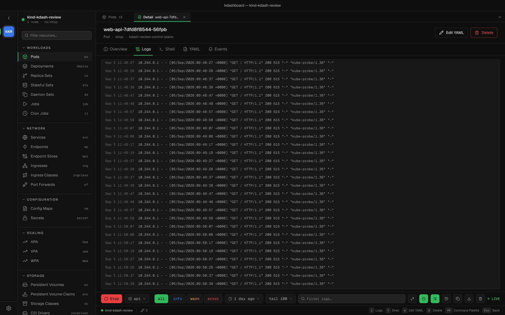</td>
    <td width="50%">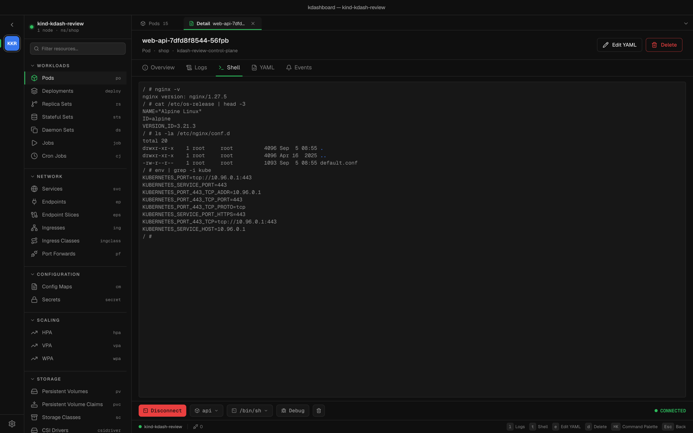</td>
  </tr>
  <tr>
    <td align="center"><sub>Streaming logs — all containers, level chips, time window, regex filter</sub></td>
    <td align="center"><sub>Shell into any container, or a node</sub></td>
  </tr>
</table>

### Change things safely

Edit YAML with schema linting and a diff before apply. Every Deployment keeps
its revision history; pick two revisions to see exactly what changed in the pod
template before you roll back.

<table>
  <tr>
    <td width="50%">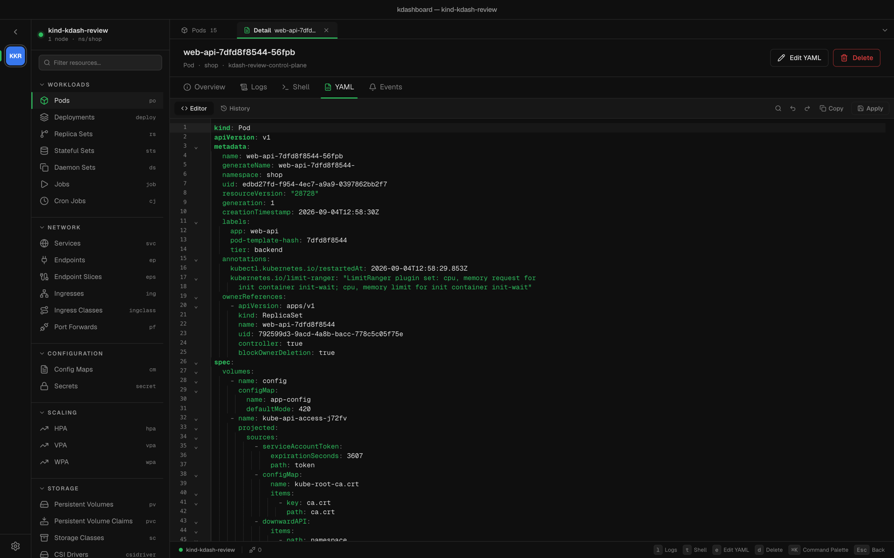</td>
    <td width="50%">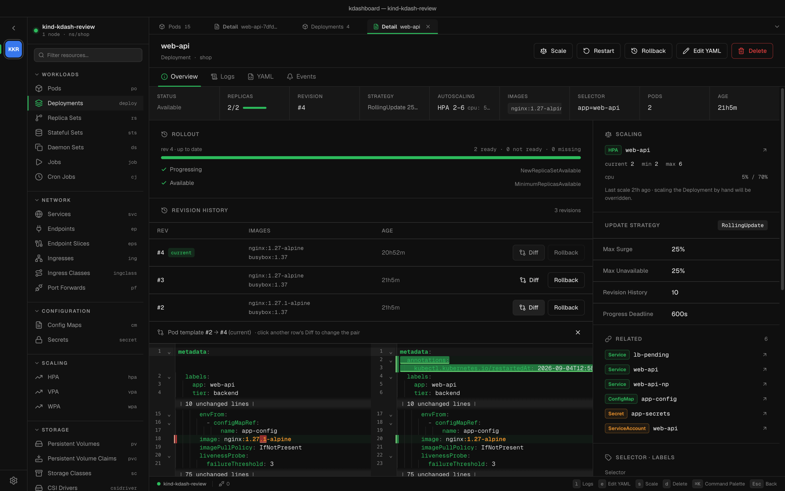</td>
  </tr>
  <tr>
    <td align="center"><sub>YAML editor with history and diff-before-apply</sub></td>
    <td align="center"><sub>Revision history with side-by-side template diff and rollback</sub></td>
  </tr>
</table>

### Understand how it fits together

<p align="center">
  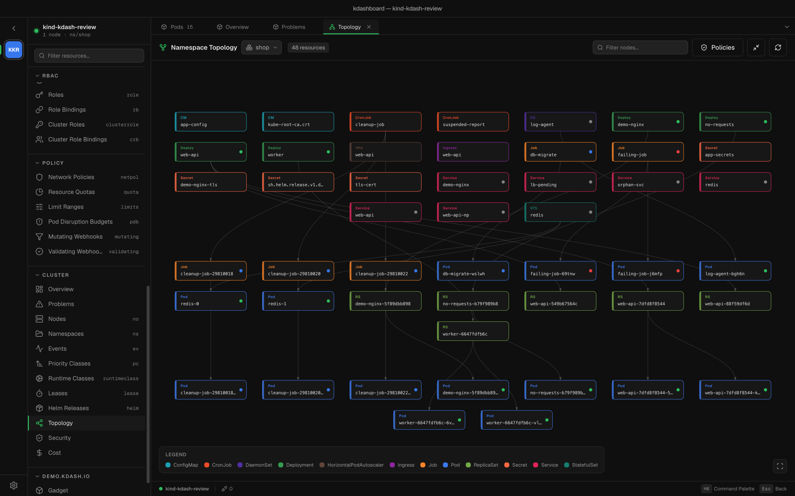
</p>

<p align="center">
  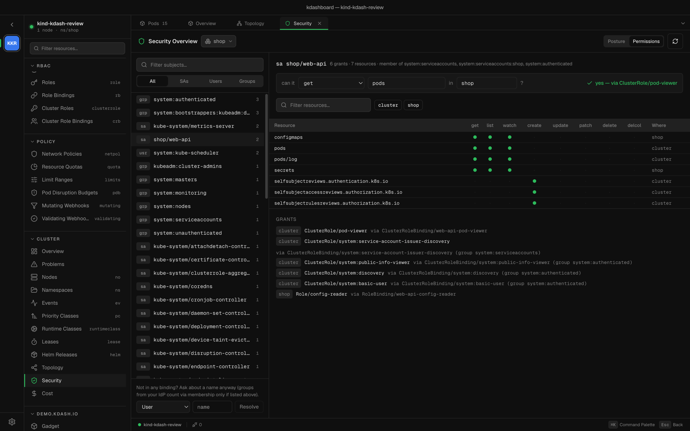
</p>

### Keep it lean

<table>
  <tr>
    <td width="50%">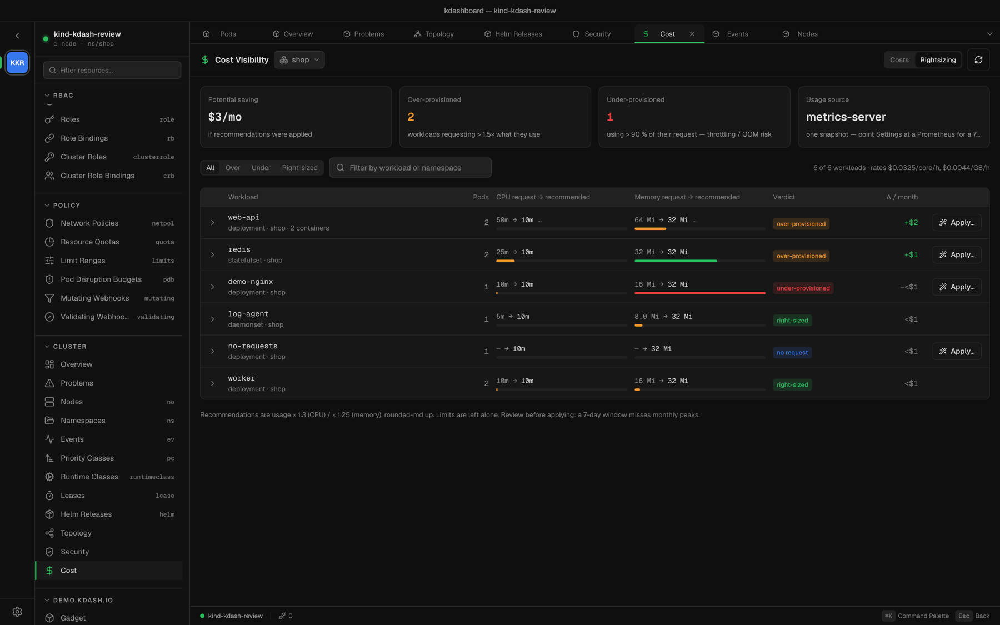</td>
    <td width="50%">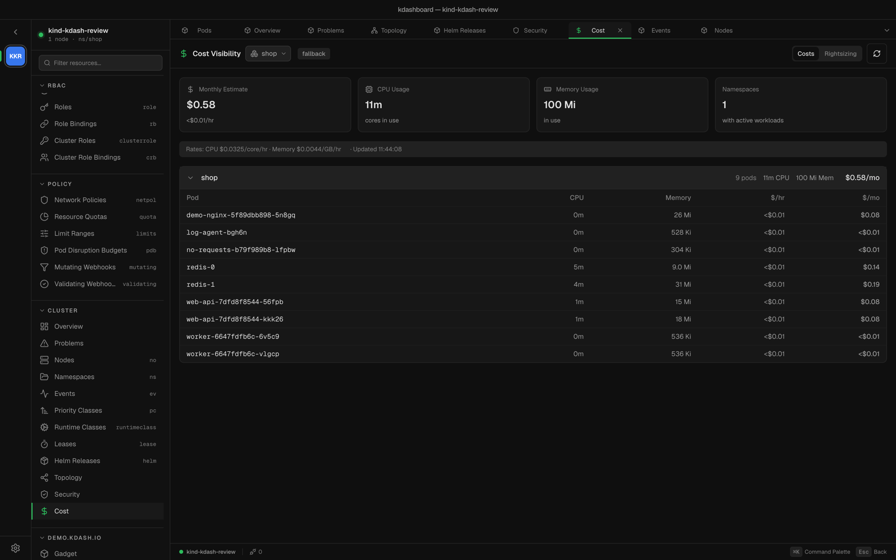</td>
  </tr>
  <tr>
    <td align="center"><sub>Rightsizing verdicts with one-click request patches</sub></td>
    <td align="center"><sub>Cost per namespace and per pod</sub></td>
  </tr>
</table>

### Ask your own AI agent

The agent panel runs the Claude Code or Codex CLI you already have, in a real
terminal, with kdashboard as its only door to the cluster. Pick "Why is it
crashing?" on a pod, "Diagnose rollout" on a deployment, "Investigate with
agent" on a Problem or an alert, or a preset such as "Cluster health check";
the agent reads through the MCP tools and asks — in the app — before it
scales, restarts, deletes a pod or changes container resources. Hide the
panel and the session keeps going; "Resume" continues the last conversation.

### And the rest

<table>
  <tr>
    <td width="33%">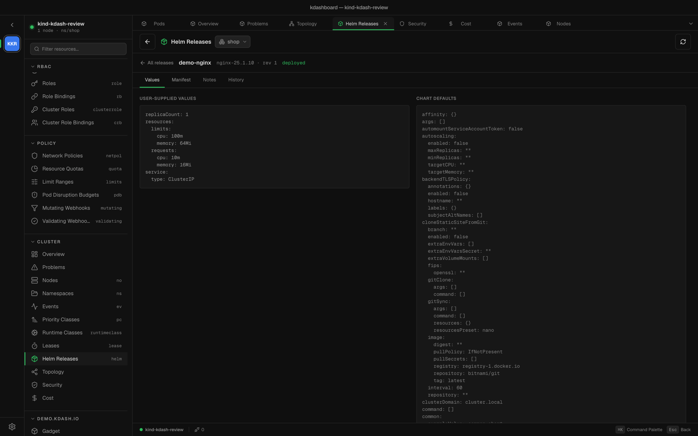</td>
    <td width="33%">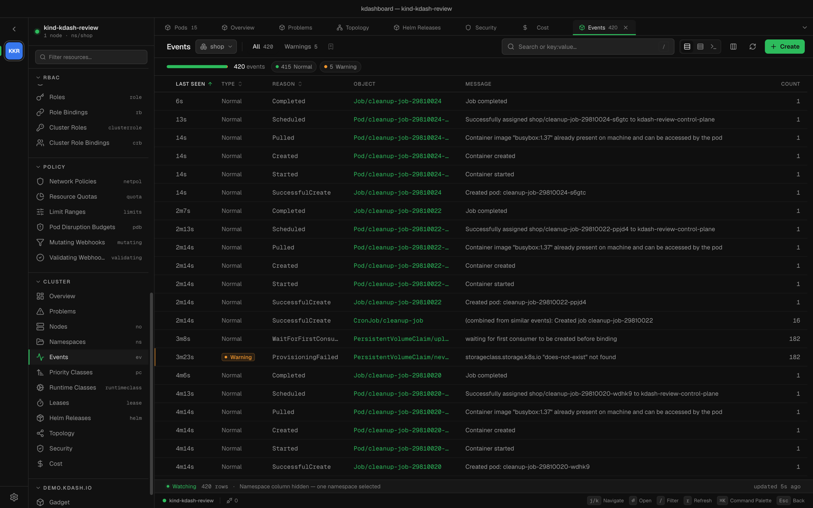</td>
    <td width="33%">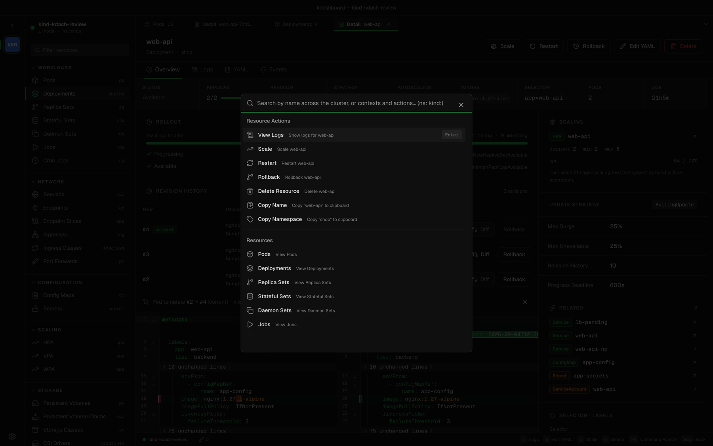</td>
  </tr>
  <tr>
    <td align="center"><sub>Helm releases without the <code>helm</code> binary</sub></td>
    <td align="center"><sub>Live Events feed</sub></td>
    <td align="center"><sub>Command palette (<kbd>⌘K</kbd>)</sub></td>
  </tr>
</table>

## Installation

### macOS

Homebrew is the recommended install and the only update channel on macOS.

```bash
brew install folio-pro/tap/kdashboard
brew upgrade --cask kdashboard      # later
```

<details>
<summary><b>Direct download and the Gatekeeper prompt</b></summary>
<br />

Download `kdashboard-<version>-arm64.dmg` (Apple Silicon) or
`kdashboard-<version>-x64.dmg` (Intel) from the
[latest release](https://github.com/folio-pro/kdashboard/releases/latest).

Releases carry an ad-hoc code signature but no Apple Developer ID and no
notarization yet, so Gatekeeper shows the unidentified-developer prompt on
first launch. Open the app once via right-click → **Open**, or strip the
quarantine flag:

```bash
xattr -cr /Applications/Kdashboard.app
```

Because the build is unsigned, Squirrel.Mac cannot install updates in place.
The app still tells you when a new version is out and points you at
`brew upgrade`.

</details>

### Linux

```bash
curl -LO https://github.com/folio-pro/kdashboard/releases/latest/download/Kdashboard-<version>.AppImage
chmod +x Kdashboard-<version>.AppImage && ./Kdashboard-<version>.AppImage
```

### Windows

Download and run `kdashboard-Setup-<version>.exe` from the
[latest release](https://github.com/folio-pro/kdashboard/releases/latest).

Linux and Windows builds update themselves in-app through `electron-updater`.
All past builds are on the [Releases page](https://github.com/folio-pro/kdashboard/releases).

### From source

See [Development](#development).

## Quick start

1. Launch kdashboard. It discovers contexts from `~/.kube/config` and
   `$KUBECONFIG`; you can also import another kubeconfig from Settings.
2. Pick a context in the cluster rail and a namespace in the picker. The app
   opens on Pods.
3. Press <kbd>⌘K</kbd> / <kbd>Ctrl+K</kbd>. Type a resource name to jump to it
   anywhere in the cluster, or an action to run it on the selected object.
4. Optional: point **Settings → Kubernetes** at a Prometheus for an hour of
   CPU and memory history in every detail panel, and install
   [`trivy`](https://github.com/aquasecurity/trivy) or `grype` locally for
   image scanning in the Security view.

kdashboard needs no in-cluster agent. It talks to the API server with your
existing credentials and honours your RBAC.

## Keyboard shortcuts

| Keys | Action |
| --- | --- |
| <kbd>⌘K</kbd> | Command palette |
| <kbd>j</kbd> / <kbd>k</kbd>, <kbd>⏎</kbd> | Move through a table, open the selected row |
| <kbd>/</kbd> | Filter the current table |
| <kbd>r</kbd> | Refresh |
| <kbd>l</kbd> · <kbd>t</kbd> · <kbd>e</kbd> | Logs · Shell · Edit YAML for the selected object |
| <kbd>s</kbd> · <kbd>d</kbd> | Scale · Delete (with confirmation) |
| <kbd>⌘L</kbd> · <kbd>⌘T</kbd> | Logs · Terminal for the open detail |
| <kbd>⌘J</kbd> | AI agent panel |
| <kbd>⌘B</kbd> · <kbd>⌘W</kbd> · <kbd>⌘,</kbd> | Toggle sidebar · Close tab · Settings |
| <kbd>Esc</kbd> | Back |

On Linux and Windows read <kbd>⌘</kbd> as <kbd>Ctrl</kbd>. The status bar
always shows the shortcuts that apply to the current view.

## Extensions

kdashboard loads user extensions from the `extensions` folder under its
user-data directory (**Settings → Extensions → Open folder**). An extension is
an ES module that registers commands, row and detail actions, settings tabs,
status-bar hints and components in named UI slots, and can call the same IPC
the app uses against the cluster. The core renders correctly with nothing
installed.

```js
export default {
  activate(ctx) {
    ctx.registerCommand({
      id: "audit-log.open",
      label: "Open audit log",
      category: "Audit",
      action: () => ctx.toast.info("Audit log", `Context ${ctx.cluster.context}`),
    });
  },
};
```

The full API is documented in [docs/extensions.md](docs/extensions.md).

## Architecture

```
┌────────────────────────────────────────────────────────────┐
│           Svelte 5 renderer (src/) — sandboxed             │
│  Runes-based stores · virtualised tables · CodeMirror 6    │
└───────────────────────────┬────────────────────────────────┘
                            │ contextBridge (window.electronAPI)
┌───────────────────────────┴────────────────────────────────┐
│                 Electron main (electron/)                  │
│  @kubernetes/client-node · watchers · streaming logs/exec  │
└───────────────────────────┬────────────────────────────────┘
                            │
                    Kubernetes API server
```

- **Renderer** — Svelte 5 with runes, Tailwind 4, bits-ui primitives,
  TanStack Virtual for large lists, xterm.js for terminals, CodeMirror 6 for
  YAML. It never touches Node or Electron APIs directly. Every store is a
  plain, unit-testable `.logic.ts` class with a thin `.svelte.ts` reactive
  subclass on top.
- **Main process** — TypeScript on `@kubernetes/client-node`. Handler modules
  under [`electron/handlers/`](electron/handlers) register commands into one
  dispatcher ([`electron/dispatch.ts`](electron/dispatch.ts)). Shared watchers
  stream resource deltas; logs, exec, port-forwards and watch events are pushed
  to the UI over named event channels.
- **IPC** — a single `k8s:invoke` channel through the preload contextBridge,
  plus event channels for streams. The only HTTP listeners on the host are the
  loopback MCP endpoints of the AI agent (below).
- **AI agent** — [`electron/agent/`](electron/agent) spawns the user's agent
  CLI in a local PTY and serves it an MCP endpoint from the main process
  (random port, per-session token, pinned to the kube context it started on),
  so the agent sees exactly the cluster the UI sees. Tools re-enter the same
  dispatcher the renderer uses; the four Safe Mutations block on an in-app
  approval. An opt-in external endpoint on a fixed port serves other MCP
  clients. See [ADR 0001](docs/adr/0001-mcp-server-in-main-process.md).
- **Kind registry** — [`electron/k8s/kinds.ts`](electron/k8s/kinds.ts) is the
  one source of truth for API coordinates, scope, aliases and the per-kind list
  projection. Adding a built-in kind is one row.

Built with [electron-vite](https://electron-vite.org) (Vite 7) and packaged
with [electron-builder](https://www.electron.build).

## Development

### Prerequisites

- Node.js 20+ and [Bun](https://bun.sh)
- A reachable cluster. `scripts/dev-cluster.sh` spins up a
  [Kind](https://kind.sigs.k8s.io) cluster seeded with sample workloads for
  manual testing.

### Setup and run

```bash
git clone https://github.com/folio-pro/kdashboard.git
cd kdashboard
bun install                 # electron is a trustedDependency; this downloads its binary

bun run dev:electron        # full app with HMR
bun run dev                 # renderer only, in the browser (mocked IPC; the e2e target)
```

### Test

```bash
bun run test                # frontend + Electron unit suites
bun run test:integration    # node:test against a real cluster (KDASH_TEST_CONTEXT=…)
bun run test:e2e            # Playwright, starts the dev server itself
bun run benchmark           # Playwright performance benchmarks
bun run typecheck:electron  # tsc on electron/
bunx svelte-check           # renderer typecheck
```

### Build a release

```bash
bun run build:electron      # electron-vite build -> out/, electron-builder -> release/
```

On macOS the `afterPack` hook (`scripts/sign-adhoc.mjs`) ad-hoc signs the
bundle. See [CLAUDE.md](CLAUDE.md) for the conventions and invariants the
codebase relies on.

## Roadmap

- Signed and notarized macOS builds with in-app updates
- Prometheus-backed history on the topology and node views
- Cluster health scorecard with trends over time
- More first-party extensions

Priorities are discussed in
[GitHub Discussions](https://github.com/folio-pro/kdashboard/discussions).
Bugs and feature requests go in
[Issues](https://github.com/folio-pro/kdashboard/issues).

## Contributing

Contributions are welcome. Read [CONTRIBUTING.md](CONTRIBUTING.md) for the
development process, commit conventions and CLA, and the
[Code of Conduct](CODE_OF_CONDUCT.md). For security issues see
[SECURITY.md](SECURITY.md) — please do not open public issues for
vulnerabilities.

## License

Source-available under the Functional Source License, Version 1.1, with an
Apache 2.0 future grant (**FSL-1.1-Apache-2.0**). Every release automatically
converts to Apache 2.0 on the second anniversary of its publication. You can
use it freely for anything except offering it as a competing hosted product.

See [LICENSE.md](LICENSE.md) for the full terms, [NOTICE](NOTICE) for
attribution, and [TRADEMARK.md](TRADEMARK.md) for use of the kdashboard name
and logo.

## Star history

<a href="https://star-history.com/#folio-pro/kdashboard&Date">
  <picture>
    <source media="(prefers-color-scheme: dark)" srcset="https://api.star-history.com/svg?repos=folio-pro/kdashboard&type=Date&theme=dark" />
    <source media="(prefers-color-scheme: light)" srcset="https://api.star-history.com/svg?repos=folio-pro/kdashboard&type=Date" />
    
  </picture>
</a>

---

<div align="center">
<sub>Built with <a href="https://www.electronjs.org">Electron</a>, <a href="https://svelte.dev">Svelte</a> and <a href="https://github.com/kubernetes-client/javascript">@kubernetes/client-node</a>. If kdashboard saves you time, a ⭐ helps others find it.</sub>
</div>
