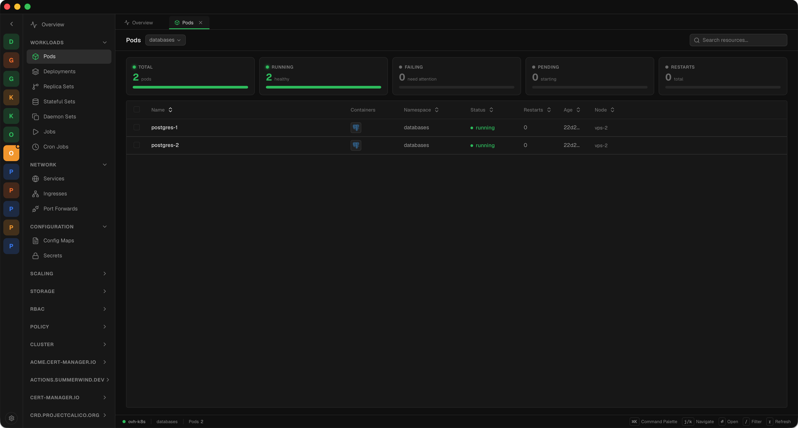

<div align="center">


# kdashboard

**A desktop IDE for Kubernetes.**

Multi-context, multi-namespace resource management with topology, cost
visibility, security overview, and diagnostics — built on Electron and
Svelte 5, available for macOS, Linux, and Windows.

[](https://github.com/folio-pro/kdashboard/releases/latest)
[](LICENSE.md)
[](https://www.electronjs.org)
[](https://svelte.dev)
[](https://www.typescriptlang.org)

[Download](https://github.com/folio-pro/kdashboard/releases/latest) · [Features](#features) · [Install](#installation) · [Quick start](#quick-start) · [Development](#development) · [Architecture](#architecture) · [Contributing](CONTRIBUTING.md)

</div>

---

## Why kdashboard

Running clusters through `kubectl` is fast but noisy, and most GUI
alternatives struggle on clusters with thousands of resources. kdashboard
is a desktop app with the ergonomics of an IDE — built for operators who
switch between contexts and namespaces all day and want a single place to
inspect, debug, and act on workloads.

## Features

- **Multi-context, multi-namespace** — switch contexts without reloading,
  pin favourites, and scope views per namespace. Namespaces are filtered by
  what your RBAC actually allows, so the picker never lists namespaces you
  cannot read.
- **Flat sidebar** — the whole resource tree in one scroll with sticky
  section headers, `kubectl` short names (`po`, `deploy`, `svc`, …), live
  counts, and a 44px collapsed rail.
- **Resource topology** — interactive graph of Deployments, Services,
  Ingresses, Pods, and their relationships.
- **Pod lifecycle tools** — streaming logs with regex filtering, exec via
  embedded xterm.js, and port-forwarding with one click.
- **Cost visibility** — per-namespace and per-workload cost estimates, with
  cloud pricing data refreshed by a scheduled job.
- **Security overview** — RBAC, NetworkPolicy, PodSecurity, and image
  posture at a glance.
- **Diagnostics** — surface events, warnings, and common failure modes for
  each resource.
- **CRD-aware** — custom resources are first-class citizens. CRD discovery
  falls back to the discovery API (`/apis`) when listing
  `CustomResourceDefinition` objects is forbidden, so it works without
  cluster-scoped RBAC. Autoscalers (HPA, VPA, and Datadog's
  `WatermarkPodAutoscaler`) are fixed entries with full table support.
- **Command palette** — keyboard-first navigation for every action.
- **YAML editor** — CodeMirror 6 with schema linting and diff view.
- **Session restore** — open tabs and the selected context/namespace come
  back the way you left them.
- **Built for large clusters** — virtualised tables, projected list payloads
  with lazy detail hydration, and shared incremental watchers that stream
  deltas instead of polling.

## Screenshots

<p align="center">
  
</p>

## Installation

### macOS — Homebrew (recommended)

```bash
brew install folio-pro/tap/kdashboard
```

Update later with:

```bash
brew upgrade --cask kdashboard
```

Because macOS builds are not signed with an Apple Developer ID, Squirrel.Mac
refuses to install updates in place — Homebrew is the update channel there.
The app still notifies you when a new version is available and points you at
the `brew upgrade` command. (Windows and Linux use the in-app auto-updater,
backed by `electron-updater`.)

### Pre-built binaries

Grab the [latest release](https://github.com/folio-pro/kdashboard/releases/latest)
for your platform (see all past builds on the
[Releases page](https://github.com/folio-pro/kdashboard/releases)):

- **macOS** — `kdashboard-<version>-<arch>.dmg` / `.zip` (Apple Silicon and Intel)
- **Linux** — `.AppImage`
- **Windows** — `kdashboard-Setup-<version>.exe` (NSIS installer)

> **macOS note — unsigned builds.** Releases carry an ad-hoc code signature
> (`codesign --sign -`) but no Apple Developer ID and no notarization. The
> ad-hoc signature is what keeps macOS from reporting the app as *"damaged
> and can't be opened"*, but Gatekeeper still shows the unidentified-developer
> prompt on first launch. Open the app once via right-click → **Open**, or
> strip the quarantine flag:
>
> ```bash
> xattr -cr /Applications/Kdashboard.app
> ```
>
> Building from source (see [Development](#development)) also avoids the
> prompt. Proper Developer ID signing + notarization will replace this
> workaround once the certificates are provisioned.

### Build from source

See [Development](#development) below.

## Quick start

1. Launch kdashboard.
2. It auto-discovers contexts from `~/.kube/config` (and `KUBECONFIG` if set).
3. Pick a context from the cluster rail, choose a namespace, and browse
   resources — the app opens directly on the Pods list.
4. Press `⌘K` / `Ctrl+K` to open the command palette.

kdashboard does not require any in-cluster agent. It talks to the Kubernetes
API using your existing kubeconfig and credentials.

## Development

### Prerequisites

- Node.js 20+ and [Bun](https://bun.sh)
- A reachable cluster — `scripts/dev-cluster.sh` spins up a seeded
  [Kind](https://kind.sigs.k8s.io) cluster for manual testing

### Setup

```bash
git clone https://github.com/folio-pro/kdashboard.git
cd kdashboard
bun install
```

### Run

```bash
bun run dev:electron      # Electron app (main + preload + renderer)
bun run dev               # Renderer only, in the browser
```

### Test

```bash
bun test                      # Frontend unit tests
bun test ./electron           # Electron backend unit tests
bun run test:integration      # Backend integration tests (node:test)
bun run test:e2e              # Playwright E2E
bun run benchmark             # Playwright performance benchmarks
```

`bun run test` runs the two unit suites together. Typecheck the backend with
`bun run typecheck:electron`.

### Build a release

```bash
bun run build:electron
```

`electron-vite build` compiles into `out/`, then `electron-builder` writes the
installers to `release/`. On macOS the `afterPack` hook
(`scripts/sign-adhoc.mjs`) ad-hoc signs the bundle.

## Architecture

```
┌────────────────────────────────────────────────────────────┐
│           Svelte 5 renderer (src/) — sandboxed             │
│  Runes-based stores · virtualised tables · CodeMirror 6    │
└───────────────────────────┬────────────────────────────────┘
                            │ contextBridge (window.electronAPI)
┌───────────────────────────┴────────────────────────────────┐
│                 Electron main (electron/)                  │
│  @kubernetes/client-node · watchers · streaming logs/exec  │
└───────────────────────────┬────────────────────────────────┘
                            │
                    Kubernetes API server
```

- **Renderer** — Svelte 5 with runes, Tailwind 4, bits-ui primitives,
  TanStack Virtual for large lists, xterm.js for terminals, CodeMirror 6
  for YAML editing. It never touches Node or Electron APIs directly.
- **Main process** — TypeScript on `@kubernetes/client-node`. Handler modules
  under [`electron/handlers/`](electron/handlers) register commands into a
  central dispatcher ([`electron/dispatch.ts`](electron/dispatch.ts)); shared
  watchers stream resource deltas, and logs, exec, and port-forwards are
  pushed to the UI over named event channels.
- **IPC** — a single `k8s:invoke` channel exposed through the preload
  contextBridge, plus event channels for streams. No HTTP server runs on the
  host.

Built with [electron-vite](https://electron-vite.org) (Vite 7) and packaged
with [electron-builder](https://www.electron.build).

See [`src/lib/`](src/lib) and [`electron/`](electron) for module layout.

## Roadmap

- Helm release browser and values editor
- Prometheus metrics overlay on topology
- Cluster health scorecard
- Plugin API for custom views

Track progress and discuss priorities in
[GitHub Discussions](https://github.com/folio-pro/kdashboard/discussions).

## Contributing

Contributions are welcome. Read [CONTRIBUTING.md](CONTRIBUTING.md) for the
development process, commit conventions, and CLA. For security issues, see
[SECURITY.md](SECURITY.md) — do not open public issues for vulnerabilities.

## License

Source-available under the Functional Source License, Version 1.1, with an
Apache 2.0 future grant (**FSL-1.1-Apache-2.0**). Every release automatically
converts to Apache 2.0 on the second anniversary of its publication.

See [LICENSE.md](LICENSE.md) for the full terms, [NOTICE](NOTICE) for
attribution, and [TRADEMARK.md](TRADEMARK.md) for use of the kdashboard
name and logo.

---

<div align="center">
<sub>Built with <a href="https://www.electronjs.org">Electron</a>, <a href="https://svelte.dev">Svelte</a>, and <a href="https://github.com/kubernetes-client/javascript">@kubernetes/client-node</a>.</sub>
</div>
